 

<table border="0" cellspacing="0" cellpadding="0">
<tr>
<td align="center" width="190">

</td>
<td align="center" width="320">

</td>
<td align="center" width="190">

</td>
</tr>
</table>

 

 

  

 

<table border="0" cellspacing="0" cellpadding="0" width="90%">
<tr>
<td align="center" width="25%">

</td>
<td align="center" width="25%">

</td>
<td align="center" width="25%">

</td>
<td align="center" width="25%">

</td>
</tr>
</table>

 

 

 

<table border="0" cellspacing="0" cellpadding="0" width="720">
<tr>
<td>

</td>
</tr>
<tr>
<td align="left" style="padding:32px 40px;background:#04060f;">

 

Цель программы - вернуть ваши биткоины, независимо от того, находятся они в вашем кошельке или нет. Работа над программой ещё продолжается, и я буду сообщать о ложных срабатываниях или проблемах.

 

***(ЭТО ПРЕДНАЗНАЧЕНО ТОЛЬКО ДЛЯ ОБРАЗОВАТЕЛЬНЫХ ЦЕЛЕЙ)***

 

</td>
</tr>
<tr>
<td>

</td>
</tr>
</table>

 

 

 

<table border="0" cellspacing="2" cellpadding="20" width="780">
<tr>
<td align="center" width="380" style="border:1px solid #1a0000;background:#04060f;">

**Анализ Кривой**

</td>
<td align="center" width="380" style="border:1px solid #1a0000;background:#04060f;">

**Подписи ECDSA**

</td>
</tr>
<tr>
<td align="center" style="border:1px solid #1a0000;background:#04060f;">

**Генератор Ключей**

</td>
<td align="center" style="border:1px solid #1a0000;background:#04060f;">

**KDF / Шифрование**

</td>
</tr>
<tr>
<td align="center" style="border:1px solid #1a0000;background:#04060f;">

**Структура Кошелька**

</td>
<td align="center" style="border:1px solid #1a0000;background:#04060f;">

**CVE / Известные Атаки**

</td>
</tr>
</table>

 

 

 

<table border="0" cellspacing="0" cellpadding="32" width="720">
<tr>
<td align="center" style="border:1px solid #8b0000;background:#04060f;">

`wallet.dat Forensic Analyzer v7`

Продвинутый анализатор кошельков Bitcoin Core с проверкой подлинности, криптографических уязвимостей и судебно-криминалистическим анализом.

 

</td>
</tr>
</table>

 

 

 

<table border="0" cellspacing="0" cellpadding="0" width="760">
<tr>
<td width="50%" valign="top" align="left" style="padding:28px 32px;border:1px solid #1a0000;background:#04060f;">

`Zhkv`

`Санкт-Петербург, Россия`

`Криптографические инструменты`

`Я создаю инструменты. В основном для криптовалют.`

</td>
<td width="50%" valign="top" align="left" style="padding:28px 32px;border:1px solid #1a0000;background:#04060f;">

Разработка инструментов для криптовалют

Написание высокопроизводительного кода

Развёртывание в облачной инфраструктуре

Построение систем обработки и визуализации данных

</td>
</tr>
</table>

 

 

 

 

 

 

**Криптография и Безопасность**

 

**Системное и Прикладное**

 

**Инструменты и Платформы**

 

 

 

 

  

 

 

 

<table align="center" border="0" cellspacing="4" cellpadding="24" width="840">
<tr>
<td align="center" width="33%" style="border:1px solid #8b0000;background:#04060f;">

`1D9MnArNXHvcGJko7HSGeTAxZqkpaEKZNB`

</td>
<td align="center" width="33%" style="border:1px solid #8b0000;background:#04060f;">

`453S3nwQ9FmLhuy6tm6x4oNhVDD8my5LLWV4epAPZAMAZN49CiVRkfUZFsc3Qpru9GGUeikCEpCXXHx4SqfPMmcRMxoB1fV`

</td>
<td align="center" width="33%" style="border:1px solid #8b0000;background:#04060f;">

`t1MtJJhhiZxEJK33ZfgKb8Vc4hcR1swMxec`

</td>
</tr>
</table>

 

 

