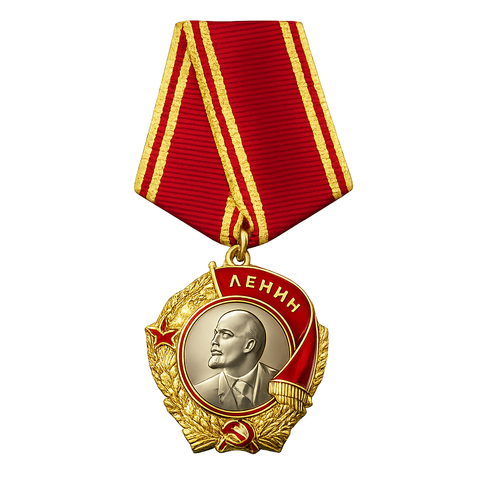

 

<table border="0" cellspacing="0" cellpadding="0">
<tr>
<td align="center" width="180">

</td>
<td align="center" width="260">

</td>
<td align="center" width="180">

</td>
</tr>
</table>

 

 

 

 

<table border="0" cellspacing="0" cellpadding="24">
<tr>
<td align="center">

**МАРШАЛ ЖКВО**

`Москва, Арбат`

</td>
<td align="center">

**Версия**

`v7.0`

</td>
<td align="center">

**Уязвимостей**

`29 проверок`

</td>
<td align="center">

**Кривая**

`secp256k1`

</td>
</tr>
</table>

 

 

### О ПРОГРАММЕ

 

<table border="1" cellspacing="0" cellpadding="28" width="680" style="border-color:#8b0000;background:#0a0a14;">
<tr>
<td align="left">

Цель программы  вернуть ваши биткоины, независимо от того, находятся они в вашем кошельке или нет. Работа над программой ещё продолжается, и я буду сообщать о ложных срабатываниях или проблемах (ЭТО ПРЕДНАЗНАЧЕНО ТОЛЬКО ДЛЯ ОБРАЗОВАТЕЛЬНЫХ ЦЕЛЕЙ).

</td>
</tr>
</table>

 

 

### КРИПТОГРАФИЧЕСКИЙ АРСЕНАЛ

 

<table border="0" cellspacing="8" cellpadding="0">
<tr>
<td align="center" width="320">

**Анализ Кривой**

`secp256k1` `ECDSA` `Символ Лежандра`

`Малые подгруппы` `Твист-атака` `Хэмминг`

</td>
<td align="center" width="320">

**Подписи ECDSA**

`Повтор Nonce` `Решётчатые атаки`

`Смещение MSB` `High-S Malleability`

</td>
</tr>
<tr>
<td align="center">

**Генератор Ключей**

`Энтропия Шэннона` `Тест хи-квадрат`

`Автокорреляция` `Корреляция Спирмена`

</td>
<td align="center">

**KDF / Шифрование**

`EVP_BytesToKey` `PBKDF2` `AES-256-CBC`

`Слабые итерации` `Нулевая соль`

</td>
</tr>
<tr>
<td align="center">

**Структура Кошелька**

`Парсер BDB` `Цепочки переполнения`

`Пробелы keypool` `Триангуляция версий`

</td>
<td align="center">

**CVE / Известные Атаки**

`Debian CVE-2008-0166` `OpenSSL PID`

`Android SecureRandom 2013`

</td>
</tr>
</table>

 

 

### ПРОЕКТ

 

<table border="0" cellspacing="0" cellpadding="20">
<tr>
<td align="center" width="680">

**Zhkv**

`wallet.dat Forensic Analyzer v7`

Продвинутый анализатор кошельков Bitcoin Core с проверкой подлинности, криптографических уязвимостей и судебно-криминалистическим анализом.

`Qt6` `Python` `secp256k1` `BDB` `AES-256` `ECDSA` `Форензика`

</td>
</tr>
</table>

 

 

### О РАЗРАБОТЧИКЕ

 

<table border="0" cellspacing="0" cellpadding="0">
<tr>
<td width="50%" valign="top" align="left" style="padding:16px">

**Разработчик**

`Zhkv`

**Местоположение**

`Санкт-Петербург, Россия`

**Направление**

`Криптографические инструменты`

**Цель**

`Я создаю инструменты. В основном для криптовалют.`

</td>
<td width="50%" valign="top" align="left" style="padding:16px">

**Деятельность**

Разработка инструментов для криптовалют

Написание высокопроизводительного кода

Развёртывание в облачной инфраструктуре

Построение систем обработки и визуализации данных

</td>
</tr>
</table>

 

 

### КРИПТОВАЛЮТНАЯ ЭКОСИСТЕМА

 

 

 

### ТЕХНОЛОГИЧЕСКИЙ СТЕК

 

**Криптография и Безопасность**

 

**Системное и Прикладное**

 

**Инструменты и Платформы**

 

 

### СТАТИСТИКА

 

 

  

 

 

### ПОДДЕРЖАТЬ ПРОЕКТ

 

<table align="center">
<tr>
<td align="center" width="33%">

`1D9MnArNXHvcGJko7HSGeTAxZqkpaEKZNB`

</td>
<td align="center" width="33%">

`453S3nwQ9FmLhuy6tm6x4oNhVDD8my5LLWV4epAPZAMAZN49CiVRkfUZFsc3Qpru9GGUeikCEpCXXHx4SqfPMmcRMxoB1fV`

</td>
<td align="center" width="33%">

`t1MtJJhhiZxEJK33ZfgKb8Vc4hcR1swMxec`

</td>
</tr>
</table>

 

 

